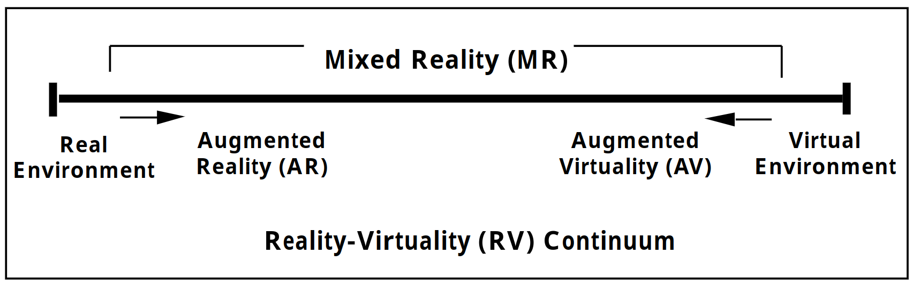
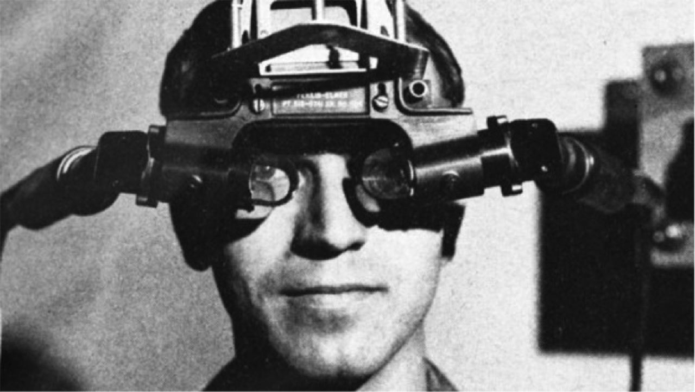
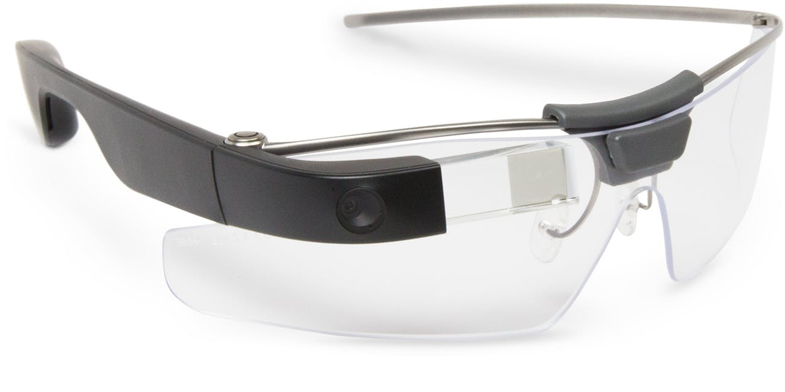
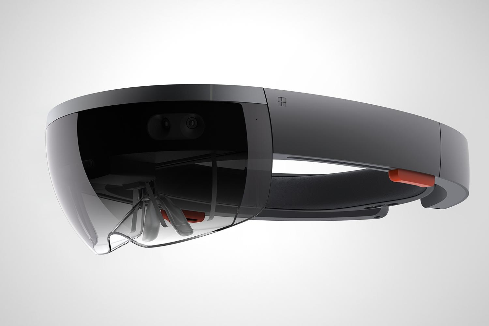
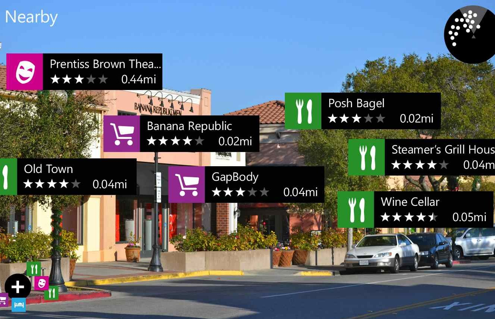

# Introduzione

## Definizione

Con il termine ***augmented reality***(da qui in poi AR), si intende un insieme di tecnologie mediante le quali è possibile arricchire, *"aumentare"*, gli oggetti che risiedono nel mondo reale con del contenuto percettivo[^olfactory] generato da un calcolatore.
Mediante l'AR è possibile aggiungere, AR *costruttiva*, o rimuovere, *AR de-costruttiva*[^destructive], contenuto informativo al mondo che ci circonda.

Risulta importate non fare confusione tra AR e VR(virtual reality), in quanto la prima, parte dal mondo reale per aggiungerci del contenuto, mentre la seconda, si pone l'obiettivo di sostituire completamente il mondo reale con uno, generato da un computer.

Recentissima, per applicazione, invece è l'MR(mixed reality), che può essere definita come un'AR potenziata, infatti in un'esperienza di MR l'utente oltre a percepire oggetti virtuali è in grado anche di interagire con essi.

Volendo elaborare una definizione di questi concetti, usando un paragone cinematografico, possiamo dire che in *The Matrix*[@wachowski:Matrix:1999] viene usata la VR.
Invece in *Iron Man*[@favreau:IronMan:2008] quando *Tony Stark* è in volo e gli vengono mostrate a video informazioni aggiuntive sta usando l'AR, mentre quando interagisce con gli ologrammi sta usando tecnologie di mixed reality.

Invece per una definizione più accurata possiamo ricorrere a quella elaborata nel 1994 da *Paul Milgram* e da alcuni suoi colleghi, che introducono il concetto di ***reality-virtuality continuum***[@milgram:AugmentedRealityClass:1994].
Nel loro lavoro hanno definito un segmento(vedi fig. \ref{rvc}) che ha ai propri estremi, da un lato l'ambiente reale, quello in cui viviamo, e dall'altro quello virtuale, completamente generato al computer. 
Esattamente a metà strada tra essi risiede la realtà mista, dove gli oggetti reali e virtuali convivono ed hanno pari valenza.

Inoltre hanno definito due stati intermedi.

- **Augmented Virtuality(AV)**:
  Stato in cui alcuni elementi reali entrano in contatto con un mondo totalmente generato al computer.
  Sebbene il termine AV sia quello meno conosciuto tra quelli citati, probabilmente tutti noi ne abbiamo avuto esperienza diretta.
  Basti pensare a tecnologie come la *Nintendo Wii*, al *Kinect*, o ai più moderni giochi per smartphone basati su giroscopio e accelerometro, in cui il movimento(reale) del giocatore va ad influenzare il gioco.
  
- ***Augmented Reality***:
  Stato in cui alcuni elementi virtuali coesistono nel mondo reale, andando ad ampliarne i confini.
  
{#rvc width=300 height=200px}

## Storia

Possiamo datare la nascita dell'AR al 1962 quando *Morton Heilig* inventa una macchina chiamata *Sensorama*.
Obiettivo di questa macchina era estendere l'esperienza audio-visiva del cinema a tutti e cinque i senti.
Durante la visione lo spettatore veniva immerso nell'azione grazie ad una visone 3D e all'audio stereofonico, inoltre poteva percepire il vento, le vibrazioni, generate tramite l'inclinazione della macchina, e addirittura gli odori.
Nonostante le potenzialità della macchina[^cinema-4d], per mancanza di investitori, *Heilig* fu costretto ad abbandonare il suo progetto. 

Una prima applicazione di AR *moderna* invece la troviamo nel 1968 quando *Ivan Sutherland* costruisce il primo visore(vedi fig. \ref{sutherland}) in grado di aggiungere elementi generati dal computer alla visione umana[@sutherland:HeadmountedThreedimensionalDisplay:1968].
Mentre per il battesimo si dovrà attendere il 1990 quanto *Tom Caudell* introduce per la prima volta il termine *augmented reality*.

{#sutherland width=300 height=200px}

Sempre agli inizi degli anni 90 arriva anche la prima applicazione non accademica da parte dell'aviazione Americana.
Tramite degli *head-up display*, ovvero un visore a sovrimpressione, venivano mostrate ai piloti delle informazioni aggiuntive, come velocità, quota, beccheggio.
In questo modo il pilota non aveva la necessità di guardare gli strumenti dell'abitacolo e poteva concentrarsi sul pilotaggio del velivolo.

A partire dalla fine degli anni 90 le tecnologie AR hanno trovato sempre maggiore applicazione nel campo dell'intrattenimento[@williamsii:HistoryAugmentedReality:2016].
Infatti è proprio a cavallo tra secondo e terzo millennio, che per la prima volta, durante una partita di NFL, la linea gialla del *primo down* viene generata da un computer.

Negli ultimi anni il fiorente progresso tecnologico ha consentito la diffusione sempre maggiore di apparecchi che permettono di fondere elementi virtuali con la realtà che li circonda.
Uno dei prodotti più riusciti sono senza dubbio i *Google Glass*(vedi fig. \ref{googleglass})[@x:Glass:2019], presentati al grande pubblico durante il Google I/O del 2013, hanno la forma di comuni occhiali, ma con l'aggiunta di un'appendice che racchiude una fotocamera e un prisma usato per ottenere un *head-up display*.
L'interazione può avvenire sia tramite un touchpad(in grado di riprodurre audio mediante conduzione ossea[^conduzione-ossea]) sia mediante comandi vocali.
Grazie a quest'ultima caratteristica è possibile avere un'esperienza d'uso *hand-free* che li ha resi particolarmente utili in campo industriale e medico.

{#googleglass width=300 height=200px}

La crescente diffusione degli smartphone e il progressivo aumento delle loro capacità di calcolo, hanno reso queste nuove tecnologie accessibili al grande pubblico.
In questo modo è scaturita una continua richiesta di contenuti AR, che ha spinto molti player del settore tecnologico ad investire in questo campo.
Investimenti che hanno fatto nascere una moltitudine di *SDK* per la realtà aumentata in grado di funzionare su smartphone.

Agli inizi del 2014 viene presentato *Google project Tango*[@googleatap:SayHelloProject:2014] uno dei progetti più interessanti e innovativi nel campo della visione artificiale e dell'AR.
Nasce dalla divisione ATAP[^atap] di Google sotto la guida di Johnny Lee, uno dei leader di *Kinect* in *Microsoft*, con l'intento di estendere le capacità di visione artificiale degli smartphone, rendendoli in grado di capire l'ambiente circostante[@eddy:GoogleFuturePhones:2015].
I *Tango devices* avevano la forma e le funzionalità di un normale smartphone, ma erano dotati di hardware specifico che gli consentiva di comprendere meglio, velocemente e più a fondo l'ambiente fisico che lo circondava.
Sebbene nel 2016 sia stata rimossa la dicitura *project* e sono stati commercializzati alcuni dispositivi di Lenovo e Asus, *Tango* non ha mai avuto grande successo né tra i produttori, né tra i consumatori.

Il mancato successo è stato determinato da una parte, dalla tendenza di Google a lanciare prodotti in eterna beta e dall'altra, dal costante miglioramento degli algoritmi di visione digitale che permettevano di ottenere risultati soddisfacenti anche su smartphone con hardware standard, e quindi più a buon mercato.
La soluzione di Google, da progetto avveniristico, si è ritrovata ad essere limitata ed acerba per il settore professional, in cui stavano emergendo soluzioni decisamente più potenti ed interessanti come *Microsoft HoloLens*[^mixed-reality](vedi fig. \ref{hololens})[@microsoft:MicrosoftHoloLens:2019], ma troppo costosa e limitante per quello consumers.

{#hololens width=300 height=200px}

Il mancato successo di *Tango* unito alla concorrenza di altri *SDK* per la realtà aumentata, tra cui *ARKit* di Apple[@apple:ARKitAppleDeveloper:2019], hanno convinto Google ad abbandonare completamente il progetto, trovandosi nella strana situazione di essere stata una delle prime ad investire in AR per smartphone, ma nonostante ciò essere indietro rispetto alla concorrenza.
Le risorse investite e le conoscenze accumulate con *Tango* hanno però permesso a Google di recuperare velocemente il terreno perso, così dalle ceneri di *Tango*[@kastrenakesGoogleProjectTango2017a] nasce *ARCore*, la piattaforma AR di Google[@googlear:ARCoreGoogleDeveloper:2019].

## Principi di funzionamento

Quando si parla di realtà aumentata, non si fa riferimento ad un'unica tecnologia, ma ad un vasto set di tecnologie.
Attualmente gli approcci più utilizzati sono l'AR basato sul riconoscimento di un pattern, quelle basate sulla geolocalizzazione e l'AR *markerless*.

### Marker based AR

L'AR marker based, anche nota come recognition based, sfrutta un sensore fotografico per riconoscere un pattern già definito a priori.
In base alla potenza della libreria utilizzata è possibile riconoscere QR-code, immagini bidimensionali, fino ad arrivare al riconoscimento di oggetti tridimensionali.
Questo tipo di AR oltre a riconoscere il pattern deve essere in grado anche di capirne l'orientamento.
L'efficacia oltre a dipendere dalla libreria utilizzata dipende anche dal dispositivo in uso e dal tipo di marker utilizzato.
Infatti condizione necessaria per ottenere risultati soddisfacenti è l'utilizzo di immagini ricche di punti caratteristici o, nel caso di riconoscimento di oggetti tridimensionali, di modelli molto dettagliati.

Questa tecnologia è impiegata prevalentemente per aggiungere dei contenuti multimediali a libri o riviste(vedi fig. \ref{mbar}).
Inoltre un impiego emergente è nel campo industriale, dove tramite opportuni modelli 3D di macchinari e impianti è possibile realizzare manuali e guide interattive.

{#mbar width=300 height=200px}

### Markerless AR

L'AR markerless, realizzata mediante degli algoritmi di tipo SLAM(*Simultaneus Localization And Mapping*), è il modo più efficace per renderizzare oggetti virtuali nel mondo reale.
Con questa soluzione non è necessario fornire all'algoritmo informazioni di base per il riconoscimento, infatti riesce a capire(*Localization*) e ricordare(*mapping*) ambienti su cui non ha altre informazioni, se non quelle catturate in real-time dai sensori.

Le maggiori applicazioni di questa tecnologia si hanno nel campo commerciale, basti pensare alla possibilità di provare un mobile o un quadro nel salotto di casa.
Altro campo in cui hanno riscosso notevole successo è quello ludico e ricreativo.

### Location based AR

La location based AR, effettua il riconoscimento dell'ambiente mediante sensori di posizionamento, sia out-door(es. GPL), sia in-door(es. Beacon Bluetooth[^beacon]).
Generalmente questo tipo di AR non opera da sola, ma in simultanea ad una delle due tecnologie sopra citate.

La maggiore applicazione di queste tecnologie si ha nella navigazione in realtà aumentata. Un esempio è la possibilità di vedere percorsi virtuali tra le strade delle città d'arte.

{width=300 height=200px}

[^cinema-4d]: Il concetto introdotto con *Sensorama* è usato tutt'oggi nei cinema 4D.

[^olfactory]: Si è soliti associare l'AR principalmente a contenuti audio-video, ma in realtà è un settore che comprende tutti e cinque i sensi. Un'ipotetica tecnologia, che dato in input un piatto, riesce a farci percepite il sapore e l'odore andrebbe ascritta comunque al campo dell'AR.

[^destructive]: Anche se meno conosciuta, la branca *de-costruttiva*, si pone l'obiettivo di rimuovere del contenuto dal mondo reale. Una delle applicazioni più interessanti, sebbene ancora in fase sperimentale, è la realizzazione di un AD blocker per il mondo reale [@vanhemert:ARExperimentThat:2015]. L'AR de-costruttiva resta ad oggi ancora marginale, sia per una carenza di idee di applicazione, sia perché espone ancora di più l'utente ai pericoli dell'AR che già hanno portato a dei decessi. Mediaticamente più interessanti sono state le morti ascrivibili a *Pokémon GO* [@pokemongodeathtracker:PokemonGODeath:2019].

[^mixed-reality]: Sebbene HoloLens sia un visore per la mixed reality, possiamo annoverarlo anche tra i dispositivi AR in quanto la realtà aumentata è una tecnologia abilitate per l'MR.

[^conduzione-ossea]: Tecnica che consente la conduzione del suono all'orecchio mediante le ossa del cranio.

[^atap]: Divisione Advanced Technology And Projects di Google, precedentemente nota come Google X.

[^beacon]: Trasmettitore Bluetooth in grado di trasmettere ripetutamente un codice alfanumerico univoco(UUID) che permette al dispositivo ricevente di localizzarsi in un ambiente chiuso.
