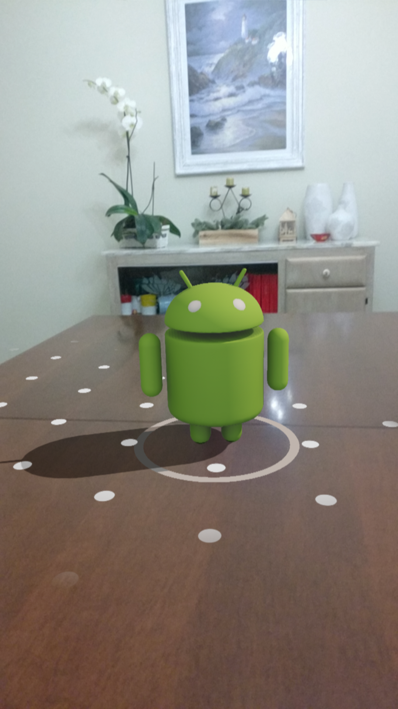

## Runtime fetching models

Nella seconda applicazione d'esempio viene mostrato come sia possibile recuperare i modelli da renderizzare anche durante l'esecuzione dell'applicazione.
Questa funzione risulta particolarmente utile quando si deve rilasciare un'applicazione che sfrutta numerosi modelli e non si vuole appesantire eccessivamente il volume del file *APK*.
Inoltre concede maggiore libertà allo sviluppatore in quanto è possibile aggiungere nuovi modelli, o aggiornare quelli vecchi, senza dover operare sull'applicazione, ma lavorando esclusivamente lato server.

In questo caso specifico l'applicazione dovrà riconosce uno o più piani e in seguito ad un tocco dell'utente su di essi, mostrare un modello di *Andy*, la mascotte di Android (vedi fig. \ref{rfm}).

Per quest'applicazione oltre alle configurazioni già viste in precedenza è necessario aggiungere una nuova dipendenza che include le funzioni necessarie per il fetching del modello.

```gradle
  implementation 'com.google.ar.sceneform:assets:$version'
```

Inoltre nell'Android Manifest bisogna aggiungere il permesso per accedere alla rete.

### Interazione con l'utente

L'interazione con l'utente avviene mediante un tocco sul display in corrispondenza di un piano.
Sceneform ci permette di personalizzare il comportamento al verificarsi di questo evento tramite il metodo `setOnTapArPlaneListener`.

```kotlin
override fun onCreate(savedInstanceState: Bundle?) {
  // ...
  arFragment.setOnTapArPlaneListener(
    this::fetchAndPlaceModel
  )
  // ...
}
```

Dove la funzione `fetchAndPlaceModel` si occupa di recuperare il modello e renderizzarlo.

```kotlin
private fun fetchAndPlaceModel(
	hitResult: HitResult,
	plane: Plane,
	motionEvent: MotionEvent
) {
  val modelUri = Uri.parse(MODEL_SOURCE)
  val fetchedModel = fetchModel(this, modelUri)
  buildRenderable(this, fetchedModel, modelUri) {
    addTransformableNodeToScene(
      arFragment,
      hitResult.createAnchor(),
      it
    )
  }
}
```

### Fetching del model

Il recupero del modello avviene attraverso la funzione `fetchModel`, che a sua volta chiama la funzione di libreria `RenderableSource.builder`.

```kotlin
fun fetchModel(
  context: Context,
  source: Uri
) : RenderableSource {
	return RenderableSource.builder()
      .setSource(
        context,
        source,
        RenderableSource.SourceType.GLTF2
      )
      .setRecenterMode(
        RenderableSource.RecenterMode.ROOT
      )
      .build()
}
```

Attualmente[^sceneform-1.6] Sceneform supporta unicamente il fetching di modelli gLTF.

### Rendering e aggiunta del modello

Il rendering del modello avviene tramite la funzione `buildRenderable`, che riprende in buona parte quella vista precedentemente, con la differenza che in questo caso deve essere passato anche il modello recuperato.

```kotlin
fun buildRenderable(
  context: Context,
  model: RenderableSource,
  modelUri: Uri,
  onSuccess: (renderable: Renderable) -> Unit
) {
  ModelRenderable.builder()
    .setRegistryId(modelUri)
    .setSource(context, model)
    .build()
    .thenAccept(onSuccess)
    .exceptionally {
      Log.e("SCENEFORM", "unable to load model", it)
      return@exceptionally null
    }
}
```

Infine l'aggiunta del modello renderizzato alla scena avviene mediante la medesima funzione `addTransformableNodeToScene` vista in precedenza.

{#rfm width=225px height=400px}

[^sceneform-1.6]: Sceneform 1.6.0.
