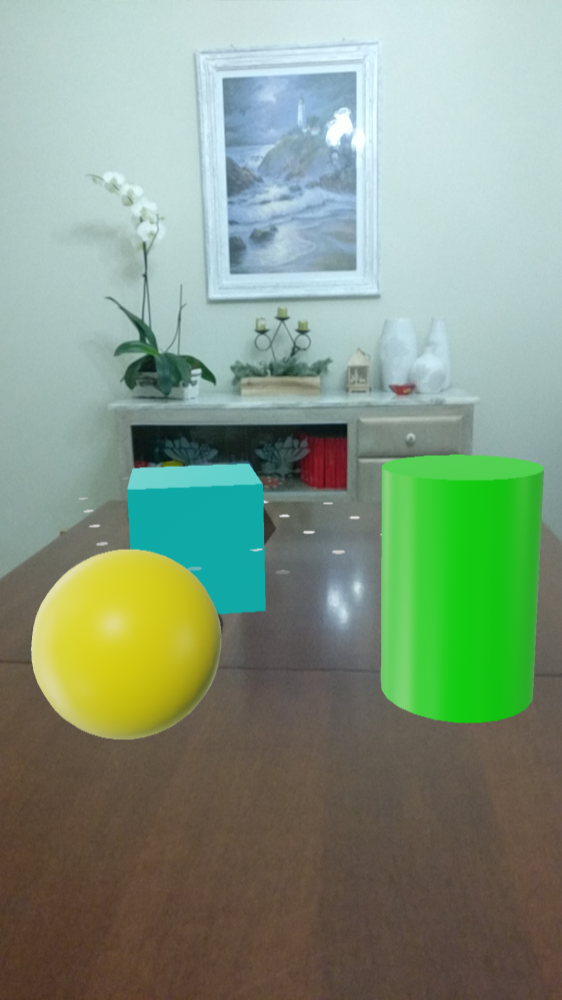

## Runtime building models

Lo scopo di questo progetto è mostrare come sia possibile costruire dei semplici modelli tridimensionali senza dover ricorrere ad asset pre costituiti.

L'SDK di Sceneform fornisce due classi per adempiere a questo compito:

- `MaterialFactory`: consente di creare un *"materiale"*, partendo o da un colore o da una texture[^texture] definita precedentemente.
- `MaterialShape`: consente di creare delle semplici forme geometriche come cilindri, sfere e cuboidi.

Nel caso specifico è stata realizzata un'applicazione che in seguito al tocco dell'utente renderizza nella scena un oggetto dalla forma e dal colore *pseudo-casuali*(vedi fig. \ref{rbm}).
Inoltre è stato aggiunto un ulteriore elemento di interazione con l'utente, che gli consente di cliccare sull'oggetto renderizzato, al fine di cambiare la tinta di quest'ultimo.

{#rbm width=225px height=400px}

### Interazione con l'utente

Anche in questo caso l'interazione con l'utente è gestita mediante il metodo `setOnTapArPlaneListener`.

```kotlin
override fun onCreate(savedInstanceState: Bundle?) {
  // ...
  arFragment.setOnTapArPlaneListener(this::addModel)
  // ...
}
```

Dove la funzione `addModel` si occupa della creazione del materiale e della forma e infine dell'aggiunta del modello alla scena.

```kotlin
private fun addModel(
  hitResult: HitResult,
  plane: Plane,
  motionEvent: MotionEvent
) {
  val color = generateColor()

  buildMaterial(this, color) {
    val node = addTransformableNodeToScene(
      arFragment,
      hitResult.createAnchor(),
      buildShape(generateShape(), it)
    )

    node.setOnTapListener {_ , _ ->
     changeColorOfMaterial(
        this,
        generateColor(),
        node.renderable
      )
    }
  }
}
```

### Creazione del materiale

La creazione del materiale avviene mediante la funzione `buildMaterial` che a sua volta richiama la funzione di libreria ` MaterialFactory .makeOpaqueWithColor`.

Come già visto in precedenza, la soluzione adottata da Sceneform per interagire con oggetti *pesanti* è una callback che nel caso specifico può essere specificata mediante il parametro `onSuccess`.

```kotlin
fun buildMaterial(
  context: Context,
  color: Color,
  onSuccess: (material: Material) -> Unit
) {
  MaterialFactory
    .makeOpaqueWithColor(context, color)
    .thenAccept(onSuccess)
}
```

### Creazione della forma

Per la costruzione della forma geometrica si è usata la funzione `buildShape` che si comporta da *facade* per le funzioni della classe di libreria `ShapeFactory`.

```kotlin
fun buildShape(
  shape: Shape,
  material: Material
): ModelRenderable {
  val center = Vector3(0.0f, 0.0f, 0.0f)
  return when (shape) {
    Shape.CUBE -> ShapeFactory
      .makeCube(Vector3(0.2f, 0.2f, 0.2f),
        center, material)
      Shape.CYLINDER -> ShapeFactory
        .makeCylinder(0.1f, 0.2f, center, material)
      Shape.SPHERE -> ShapeFactory
        .makeSphere(0.1f, center, material)
  }
}
```

Come è possibile notare a seconda della figura, vanno specificate le caratteristiche spaziali che la contraddistingue e il materiale creato precedentemente.

### Aggiunta del nodo alla scena

L'aggiunta di un nuovo nodo alla scena avviene mediante la funzione `addTransformableNodeToScene` che presenta il medesimo comportamento visto nei precedenti progetti, con l'unica differenza del valore di ritorno.
Infatti se prima veniva restituito un'`Unit`[^unit] in questo caso viene restituito un oggetto di tipo `Node`.

Questa modifica si rende necessaria per poter aggiungere al nodo un listener sull'evento di tocco.
Questa operazione avviene mediante il metodo `setOnTapListener`, al quale, mediante una *lambda expression*, viene passata la funzione `changeColorOfMaterial`.

```kotlin
fun changeColorOfMaterial(
  context: Context,
  color: Color,
  renderable: Renderable
) {
  buildMaterial(context, color) {
    renderable.material = it
  }
}
```

Quest'ultima funzione si occupa di creare un nuovo materiale e sostituirlo a quello precedente.

[^texture]: In ambito grafico con il termine *texture* si è soliti indicare una qualità visiva che si ripete mediante un pattern ben definito.

[^unit]: Equivalente in Kotlin dell'oggetto `Void` di Java.
