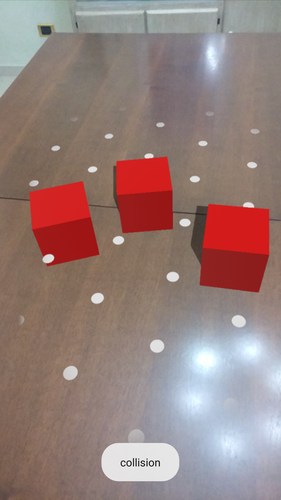

## Collision

Quando si ha a che fare con più nodi presenti sulla scena può risultare utile verificare se due o più di questi si sovrappongono.
In questo progetto viene mostrato come eseguire questo controllo mediante l'API di ARCore.

Per questo progetto si è utilizzata una rivisitazione dell'applicazione vista nel progetto precedente, con la differenza che l'aggiunta di un oggetto non è consentita se questo va in collisione con un altro già presente nella scena(vedi fig. \ref{c}).

{#c width=225px height=400px}

### Rilevamento della collisione

Attualmente ARCore e Sceneform non forniscono nessun listener o metodo che può essere sovrascritto per la gestione della collisione, quindi seguendo un approccio già esaminato precedentemente andiamo ad aggiungere un listener all'evento dell'aggiornamento della scena.

```kotlin
override fun onCreate(savedInstanceState: Bundle?) {
  // ...
  arScene.addOnUpdateListener(this::onUpdate)
  // ...
}
```

La verifica di una collisione può essere effettuata o attraverso il metodo `overlapTest`, che dato un nodo in input restituisce il primo nodo che entra in collisione con questo, oppure mediante il metodo `overlapTestAll`, che dato un nodo in input restituisce una lista con tutti i nodi che collidono con esso.
Nel caso in cui non siano state riscontrate collisioni, i metodi restituiscono rispettivamente `null` e una lista vuota.

La funzione `onUpdate` si occupa di verificare la presenza di collisioni.

```kotlin

private fun onUpdate(frameTime: FrameTime) {
  val node = lastNode ?: return
  val overlappedNodes = arScene.overlapTestAll(node)
  if (overlappedNodes.isNotEmpty())
    onCollision()
}
```

Mentre la funzione `onCollision` si occupa di notificare all'utente l'avvenuta collisione mediante un *Toast*[^toast] e di eliminare il nodo dalla scena.

```kotlin
private fun onCollision() {
  Toast.makeText(this, "collision", Toast.LENGTH_LONG)
    .show()
  lastNode?.isEnabled = false
  lastNode = null
}
```

Il test di collisione non avviene direttamente sul `Renderable`, ma sulla `CollisionShape` ovvero una *"scatola"* invisibile che racchiude il modello renderizzato vero e proprio.
Di default ARCore utilizza `CollisionShape` o di forma rettangolare o sferica, ma può essere cambiata mediante il metodo `setCollisionShape` della classe `Node`.
In questo progetto si è usata la `CollisionShape` di default.

### Aggiunta del nodo alla scena

L'aggiunta del nodo alla scena avviene mediante l'aggiunta di un listener all'evento di tocco su un piano.

```kotlin
override fun onCreate(savedInstanceState: Bundle?) {
  // ...
  arFragment.setOnTapArPlaneListener(this::addShape)
  // ...
}
```

La funzione `addShape`, utilizzando le funzioni `buildMaterial` e `buildShape` analizzate in precedenza, si occupa dell'effettiva aggiunta dell'oggetto alla scena.

```kotlin
private fun addShape(
  hitResult: HitResult,
  plane: Plane,
  motionEvent: MotionEvent
) {
  val red = Color(android.graphics.Color.RED)

  buildMaterial(this, red) {
    val cube = buildShape(Shape.CUBE, it)

    lastNode = addNodeToScene(
      arFragment,
      hitResult.createAnchor(),
      cube
    )
  }
}
```

Risulta importante notare come attraverso questa strategia l'aggiunta del modello alla scena avvenga incondizionatamente, ed è solo all'aggiornamento di quest'ultima che si effettua il controllo di collisione sull'ultimo nodo aggiunto.

[^toast]: Oggetto nativo di Android mediante il quale è possibile informare l'utente in modo non invasivo.
