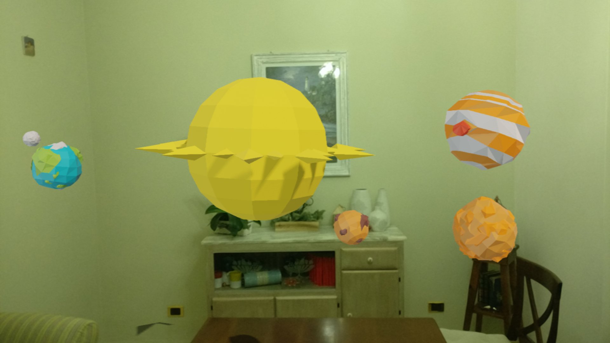

### Movimento

Anche in questo caso Sceneform non ci fornisce un supporto diretto, ma a differenza di quanto visto con le animazioni, è possibile sopperire a questa mancanza abbastanza facilmente e con risultati soddisfacenti tramite gli `ObjectAnimator`.

L'`ObjectAnimator` non è una classe specifica di ARCore o Sceneform, ma dell'SDK di Android che può essere usata per gestire facilmente animazioni e transizioni all'interno delle applicazioni Android.
Grazie a questa classe e una serie di punti nello spazio, *collegati* tramite un interpolatore, saremo in grado di conferire il movimento ai nostri modelli.

Per mostrare il funzionamento degli animator è stato realizzato un progetto d'esempio in grado di renderizzare un modello del sistema solare in cui i pianeti realizzano sia il modo di rotazione su se stessi, sia quello di rivoluzione intorno al sole (vedi fig. \ref{ss}).

{#ss width=400px height=225px}

#### Recupero e rendering dei modelli

Visto l'elevato numero di modelli con cui si deve operare si è scelto di recuperarli da un server a runtime.
Il procedimento è simile a quello visto precedentemente, con la differenza che in questo caso non si è optato per l'utilizzo delle callback, al fine di evitare il *callback hell*[^callback-hell], a favore delle *coroutines*, uno strumento messo a disposizione dal linguaggio Kotlin che permette di gestire codice asincrono come se fosse sequenziale.
Sempre attraverso le *coroutines* è stato possibile eseguire più rendering in parallelo e quindi ottimizzare il tempo di CPU dell'applicazione.

All'interno del metodo `onCreate` viene avviata una coroutine che richiama la funzione `loadPlanets`.
Inoltre viene conservato un riferimento al `Job` della coroutine.

```kotlin
override fun onCreate(savedInstanceState: Bundle?) {
  // ...
  loadPlanetsJob = GlobalScope.launch(Dispatchers.Main){
    renderablePlanets = loadPlanets(this@MainActivity)
  }
  // ...
}
```
La funzione `loadPlanets` si occupa di caricare e restituire tramite una `Map` tutti i pianeti del sistema solare.
Mentre il caricamento del singolo pianeta avviene mediante la funzione `loadPlanet`.

```kotlin
suspend fun loadPlanets(
  context: Contex
) : Map<Planet, ModelRenderable> {
  val sun = loadPlanet(context, Planet.SUN)
  /** 
    * ...
    * caricamento degli altri pianeti
    * ...
    */
  val neptune = loadPlanet(context, Planet.NEPTUNE)

  return mapOf(
    Pair(Planet.SUN, sun.await()),
   	// ...
    Pair(Planet.NEPTUNE, neptune.await())
  )
}
```

Nella funzione `loadPlanet` viene da prima recuperato il modello tridimensionale dal server e successivamente se ne effettua il rendering attraverso la funzione `buildFutureRenderable`.
Quest'ultima, come abbiamo già visto, restituisce un `CompletableFuture` che per poter essere utilizzato tramite delle coroutines deve essere trasformarlo in un `Deferred`[^deferred].
Questa operazione avviene attraverso il costruttore di coroutines `async`.
Inoltre viene usato il dispatcher `IO` che ci consente di eseguire l'operazione in background.

```kotlin
fun loadPlanet(
  context: Context,
  planet: Planet
): Deferred<ModelRenderable> {
  val modelSource = fetchModel(
    context,
    Uri.parse(planet.value)
  )
  val futureRenderable = buildFutureRenderable(
    context,
    modelSource,
    Uri.parse(planet.value)
  )

  return GlobalScope.async(Dispatchers.IO) {
   futureRenderable.get()
  }
}
```

L'ultima operazione da dover effettuare prima di poter usare i modelli renderizzati è assicurarci che l'operazione di rendering sia stata completata.
Per fare ciò viene usato ancora una volta il costruttore di coroutines `launch` e si attende, in modo non bloccante, il completamento del job di rendering.

```kotlin
GlobalScope.launch(Dispatchers.Main) {
  loadPlanetsJob.join()
  // operazioni con gli oggetti renderizzati
}
```

#### Orbite e pianeti

Per realizzare le orbite e i pianeti è stata implementata la classe `RotationNode` che va ad estendere la classe di libreria `Node`.

Componente principale di questa è la funzione `createAnimator` che si occupa della creazione dell'`ObjectAnimator` che permette di muovere i modelli.
All'interno della funzione vengono definiti i punti da cui ottenere la rotazione attraverso l'interpolatore.
Infine viene impostato l'`ObjectAnimator` affinché riproduca in loop l'animazione.

```kotlin
private fun createAnimator(): ObjectAnimator {
  val orientations = arrayOf(0f, 120f, 240f, 360f)
    .map { 
      Quaternion
        .axisAngle(Vector3(0.0f, 1.0f, 0.0f), it)
    }

  val orbitAnimation = ObjectAnimator()
  orbitAnimation.setObjectValues(*orientations.toTypedArray())

  orbitAnimation.setEvaluator(QuaternionEvaluator())

  orbitAnimation.repeatCount = ObjectAnimator.INFINITE
  orbitAnimation.repeatMode = ObjectAnimator.RESTART
  orbitAnimation.interpolator = LinearInterpolator()
  orbitAnimation.setAutoCancel(true)

  return orbitAnimation
}
```

Inoltre nella classe `RotationNode` vanno sovrascritti i metodi `OnActivate` e `OnDeactivate`, per gestire lo start e lo stop dell'animazione.

```kotlin
override fun onActivate() {
  startAnimation()
}

override fun onDeactivate() {
  stopAnimation()
}
```

La creazione dei pianeti è gestita attraverso un ulteriore classe, `PlanetNode`, anch'essa estensione della classe `Node`.
Quest'ultima viene definita come un nodo dotato di un `Renderable` ancorato ad un `RotationNode`.
Come vedremo in seguito questa operazione si rende necessaria per garantire il moto di rivoluzione.

La creazione delle orbite e dei pianeti avviene mediante la funzione `createPlanetNode`.
L'orbita del pianeta viene ancorata al nodo principale, nel caso specifico il sole, e il pianeta viene ancorato alla sua orbita.
Inoltre viene assegnato anche il renderable al nodo del pianeta.

```kotlin
private fun createPlanetNode(
  planet: Planet,
  parent: Node,
  auFromParent: Float,
  orbitDegreesPerSecond: Float,
  renderablePlanets: Map<Planet, ModelRenderable>
) {
  val orbit = RotationNode()
  orbit.degreesPerSecond = orbitDegreesPerSecond
  orbit.setParent(parent)

  val renderable = renderablePlanets[planet] ?: return
  val planetNode = PlanetNode(renderable)
  planetNode.setParent(orbit)
  planetNode.localPosition = Vector3(
    AU_TO_METERS * auFromParent,
    0.0f,
    0.0f
  )
}
```

È importante notare che in questo modo non sono i pianeti a ruotare intorno al sole, ma sono le orbite a ruotare su se stesse e visto che i pianeti sono *"incollati"* ad esse si ha l'illusione del moto di rivoluzione.

#### Creazione e aggiunta del sistema solare

La creazione del nostro sistema solare avviene mediante la funzione `createSolarSystem` che riceve in ingresso la `Map` con tutti i modelli dei pianeti, li posiziona intorno al sole e infine restituisce quest'ultimo.

```kotlin
private fun createSolarSystem(
  renderablePlanets: Map<Planet, ModelRenderable>
): Node {
  val base = Node()

  val sun = Node()
  sun.setParent(base)
  sun.localPosition = Vector3(0.0f, 0.5f, 0.0f)

  val sunVisual = Node()
  sunVisual.setParent(sun)
  sunVisual.renderable = renderablePlanets[Planet.SUN]
  sunVisual.localScale = Vector3(0.5f, 0.5f, 0.5f)

  createPlanetNode(
    Planet.MERCURY,
    sun,
    0.4f,
    47f,
    renderablePlanets
  )
  // ...
  createPlanetNode(
    Planet.NEPTUNE,
    sun,
    6.1f,
    5f,
    renderablePlanets
)

  return base
}
```

L'aggiunta dei modelli alla scene avviene mediante la ben nota funzione `addNodeToScene`.

```kotlin
val solarSystem = createSolarSystem(renderablePlanets)
addNodeToScene(
  arFragment,
  hitResult.createAnchor(),
  solarSystem
)
isModelAdded = true
```

Anche in questo caso si rende necessario l'utilizzo di un flag booleano per evitare l'aggiunta di più sistemi solari.

[^callback-hell]: Con il termine *callback hell* si indica l'utilizzo eccessivo di callback all'interno di altre callback. Questo fenomeno comporta una diminuzione della leggibilità del codice e un aumento della complessità e di conseguenza della presenza di bug.

[^deferred]: In Kotlin i *future* sono gestiti mediante l'oggetto `Deferred<T>`.
