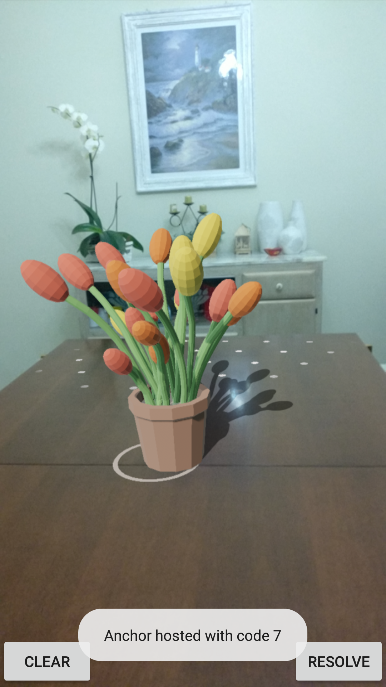
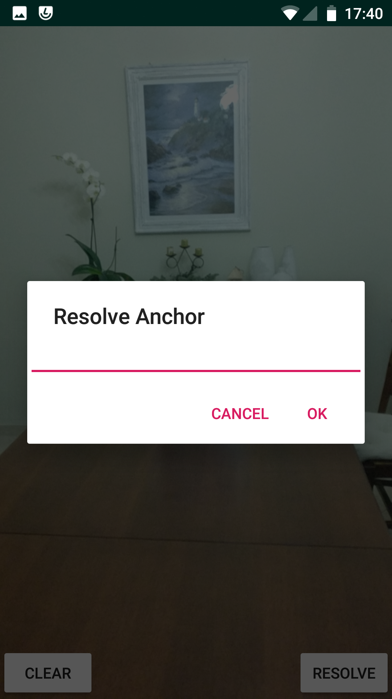

## Cloud anchors

Un'ulteriore funzionalità messa a disposizione da ARCore sono le *Cloud Anchors* che ci permette di salvare su un server remoto le ancore a cui sono agganciati i nodi.
Grazie a questa funzionalità è possibile salvare un'esperienza di realtà aumentata per un uso futuro[^futuro] o per condividerla con altri utenti.

In questo progetto verrà mostrato come sia possibile posizionare, tramite il device A, un vaso di fiori su una superficie piana, e vedere la stessa scena sul dispositivo B.

{#ca1 width=225px height=400px}

{#ca2 width=225px height=400px}

### Configurazioni iniziali

Per poter sfruttare le cloud anchors è necessario richiedere un API KEY sul sito di Google \url{https://console.cloud.google.com/apis/library/arcorecloudanchor.googleapis.com}.
Una volta ottenuta la chiave è necessario dichiararla nell'Android Manifest mediante il seguente codice xml.

```xml
<meta-data
   android:name="com.google.android.ar.API_KEY"
   android:value="API_KEY"/>
```

Inoltre per tenere traccia dello stato dell'applicazione si è definita una classe enumerativa con cinque possibili valori.

- `NONE`: non è presente alcuno oggetto nella scena né se ne sta recuperando uno dal server.
- `HOSTING`: si sta caricando l'ancora sul server.
- `HOSTED`: l'ancora è stata caricata sul server.
- `RESOLVING`: si sta recuperando l'ancora dal server.
- `RESOLVED`: l'ancora è stata recuperata del server.

### Attivazione delle cloud anchors

Le cloud anchors di default sono disattivate e la loro attivazione può avvenire in due modi.

- **Attivazione manuale**:
  Con questa soluzione lo sviluppatore si occupa di creare una nuova configurazione della sessione di ARCore in cui le cloud anchors sono attivate e andare a sostituire questa nuova configurazione a quella di default.
- **Estensione dell'`ArFragment`**:
  Viene creata una nuova classe che estende `ArFragment` in cui le cloud anchors sono attivate.
  
Sebbene la prima soluzione possa sembrare più immediata, nasconde una grande insidia.
Infatti sarà compito dello sviluppatore andare a sovrascrivere i vari metodi che gestiscono il ciclo di vita dell'activity affinché non vengano ripristinate le impostazioni iniziali.
Mentre con il secondo metodo sarà Sceneform a gestire il ciclo di vita al posto nostro.

Per questo motivo è stata creata la classe `CloudArFragment` in cui è stata sovrascritta la funzione `getSessionConfiguration` in modo da attivare le cloud anchors.

```kotlin
class CloudArFragment: ArFragment(){
  override fun getSessionConfiguration(
    session: Session?
  ): Config {
    val config = super.getSessionConfiguration(session)
    config.cloudAnchorMode = Config
      .CloudAnchorMode.ENABLED
    return config
  }
}
```

Inoltre bisogna modificare anche il file di layout affinché non utilizzi più l'`ArFragment`, ma il `CloudArFragment`.

```xml
<fragment
  android:layout_width="match_parent"
  android:layout_height="match_parent"
    android:name="it.norangeb.cloudanchors.CloudArFragment"
  android:id="@+id/ar_fragment"/>
```

### Cloud Anchor Helper

Quando viene caricata un'ancora sul server viene associata ad essa un valore alfanumerico che ci permette di identificarla univocamente.
Dato che il codice risulta essere molto lungo e quindi difficile da ricordare e ricopiare, si è scelto di appoggiarsi al servizio *firestore * di Firebase\cite{firebase:Firebase:2019} per creare una relazione uno a uno tra l'UUID e uno *short code* intero.

Queste operazioni avvengono tramite la classe `CloudAnchorHelper` che fornisce due metodi principali `getShortCode` e `getCloudAnchorId`.

```kotlin
fun getShortCode(cloudAnchorId: String): Int {
  fireStoreDb.collection(COLLECTION)
    .document(DOCUMENT)
    .set(
      mapOf(Pair(nextCode.toString(), cloudAnchorId)),
      SetOptions.merge()
    )
    uploadNextCode(nextCode+1)
    
    return nextCode++
}
```

```kotlin
fun getCloudAnchorId(
  shortCode: Int,
  onSuccess: (String) -> Unit
) {
  fireStoreDb.collection(COLLECTION)
  .document(DOCUMENT)
  .get()
  .addOnSuccessListener {
    val uuid=it.data.get(shortCode.toString()) as String
    onSuccess(uuid)
  }
}
```

Il primo metodo riceve in ingresso l'UUID dell'ancora e lo aggiunge al database di Firebase usando come chiave un numero intero che viene restituito al chiamante.
Mentre il secondo metodo, dato il codice intero, recupera l'identificativo dell'ancora e svolge su di esso le operazioni specificate nella *lambda expression* `onSuccess`.

### Aggiunta del modello

L'aggiunta del modello avviene attraverso la funzione `addModel`, che opera in modo simile a quanto visto fin'ora, con l'unica differenza che l'aggiunta è consentita solo se l'applicazione si trova nello stato `NONE`.
Inoltre la creazione dell'ancora è delegata al metodo `hostCloudAnchors` che si occupa anche dell'upload di quest'ultima sul server.

```kotlin
private fun addModel(
  hitResult: HitResult,
  plane: Plane,
  motionEvent: MotionEvent
) {
  if (cloudAnchorState != CloudAnchorState.NONE)
    return

  cloudAnchor = arFragment.arSceneView.session
    .hostCloudAnchor(hitResult.createAnchor())

  cloudAnchorState = CloudAnchorState.HOSTING

  buildRenderable(this, Uri.parse("model.sfb")) {
    addTransformableNodeToScene(
      arFragment,
      cloudAnchor ?: return@buildRenderable,
      it
    )
  }
}
```

### Check Hosting

Il metodo `checkCloudAnchor` viene eseguito ogni qual volta viene aggiornata la scena e, in base allo stato dell'applicazione vengono eseguite determinate operazioni.

```kotlin
private fun checkCloudAnchor(frameTime: FrameTime) {
  if (cloudAnchorState != CloudAnchorState.HOSTING
    && cloudAnchorState != CloudAnchorState.RESOLVING
  )
    return

  val cloudState=cloudAnchor?.cloudAnchorState?:return

  if (cloudState.isError) {
    toastError()
    cloudAnchorState = CloudAnchorState.NONE
    return
  }

  if (cloudState != Anchor.CloudAnchorState.SUCCESS)
    return

  if (cloudAnchorState == CloudAnchorState.HOSTING)
    checkHosting()
  else
    checkResolving()
}
```

Nel caso specifico in cui il processo di caricamento sia stato completato con successo viene eseguita la funzione `checkHosting` che si occupa di notificare all'utente il codice numerico associato all'ancora (vedi fig. \ref{ca1}) e di cambiare lo stato dell'applicazione da `HOSTING` a `HOSTED`.

```kotlin
private fun checkHosting() {
  val cAnchor = cloudAnchor ?: return

  val shortCode = cloudAnchorsHelper
    .getShortCode(cAnchor.cloudAnchorId)

  Toast
    .makeText(
      this,
      "Anchor hosted with code $shortCode",
      Toast.LENGTH_LONG
    )
    .show()

  cloudAnchorState = CloudAnchorState.HOSTED
}
```

### Resolving dell'ancora

L'utente può ripristinare un'ancora premendo sul pulsante *resolve*.
Il listener associato a questo evento è racchiuso nella funzione `onResolve` che a sua volta mostra all'utente un dialog in cui può inserire il codice dell'ancora da ripristinare (vedi fig. \ref{ca2}).

```kotlin
fun onResolveClick(view: View) {
  if (cloudAnchor != null)
    return

  val dialog = ResolveDialogFragment()
  dialog.setOkListener(this::onResolveOkPressed)
  dialog.show(supportFragmentManager, "Resolve")
}
```

Alla conferma dell'inserimento, da parte dell'utente, viene eseguito il metodo `onResolveOkPressed` che converte lo *short code* nell'UUID dell'ancora e da questo ripristina il nodo nella scena.

```kotlin
private fun onResolveOkPressed(dialogValue: String) {
  val shortCode = dialogValue.toInt()
  cloudAnchorsHelper.getCloudAnchorId(shortCode) {
    cloudAnchor = arFragment.arSceneView.session
      .resolveCloudAnchor(it)

    buildRenderable(this, Uri.parse("model.sfb")) {
      val anchor = cloudAnchor ?: return@buildRenderable
      addTransformableNodeToScene(arFragment, anchor, it)
      cloudAnchorState = CloudAnchorState.RESOLVING
    }
  }
}
```

[^futuro]: Il ripristino non può essere troppo dilazionato nel tempo in quanto le ancore vengono conservate sul server per massimo ventiquattro ore.
